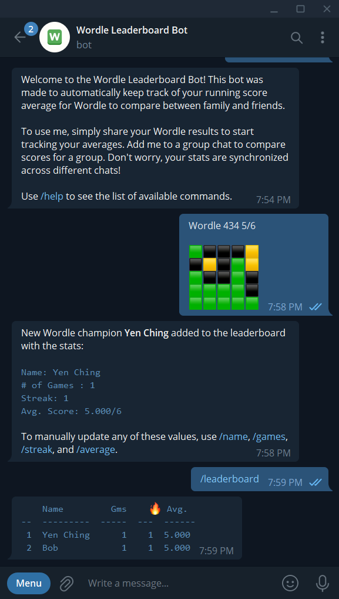
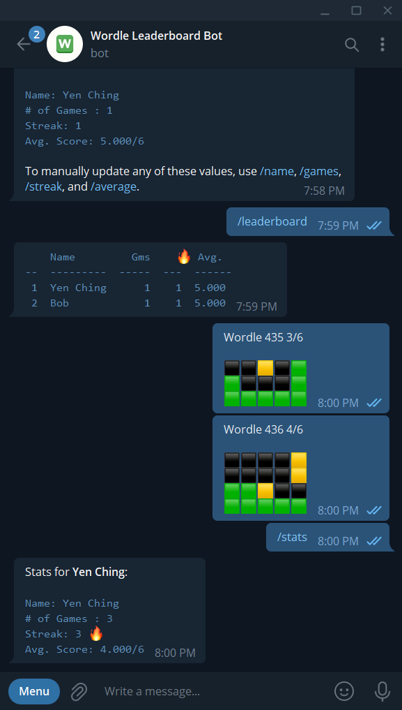

<h1 align="center">Wordle Leaderboard Bot 🤖</h1>
<p align="center">
  
  
  
  
</p>
Wordle Telegram bot to display leaderboards in group chats and automatically keep track of score averages, streak, and number of games through result sharing.

## 💡 Motivation ##
At the height of my Wordle craze, I would manually calculate score averages for a whole group and it was incredibly tedious to do so. This was built to automate that task for competitive culmulative score comparison.

## ✨ Preview ##
<div align="center">
  <figure>
    <div align="center" style="display:block;">
      
      
    </div>
    <figcaption>Examples of printing leaderboard (left) and auto-updating stats (right) capabilities</figcaption>
  </figure>
  <s><h3>🔗 Check out the live bot on telegram (<a href="https://t.me/WordleScoreboardBot">@WordleScoreboardBot</a>)!</h3></s>
  <h3>Note: due to the deprecation of Heroku's free tier and the depreciation in usage from family and friends, this project's deployment is no longer being supported.</h3>
</div>

## ⭐ Features ##
* Automatically record and update stats (score average, streak, and number of games) from Wordle results
  * Enable/disable retroactive stats updates from older games played
* Print user stats and chat leaderboard upon user request
* Allow manual changing/updating of user stats to account for missing information
* Clear user database upon user request
* Persistent user data storage through MongoDB
* [NEW as of v1.0.2] Distributed database logic (MongoDB `"lock"` atrribute with while loop) to mitigate duplicate updates

## 🛠️ Implementation ##
This project was coded in Python using [pyTelegramBotAPI](https://github.com/eternnoir/pyTelegramBotAPI), [pymongo](https://github.com/mongodb/mongo-python-driver), and deployed on [Heroku](https://www.heroku.com/).

The bot works by extracting the edition and number of tries from the shared Wordle result and using that information to update the score average, number of games, and streak.

Hence, the data is prone to being corrupted by accidental or incorrect entries. However, I have aimed to minimize this by putting checks in place to ensure no update persists when the edition played has already been recorded or is older than the most recent recorded edition (unless enabled by user).

## 🧰 Dependencies ##
The full list can be found in [requirements.txt](https://github.com/yauyenching/wordle-tele-bot/blob/main/requirements.txt).

## ⚙️ Building this Project ##
To deploy this application locally, get your own Telegram bot token (from [@BotFather](https://t.me/BotFather), more on that [here](https://core.telegram.org/bots#6-botfather)) and create your own MongoDB database cluster. Clone this repository and navigate to its directory. Then, in an .env file in the root folder:
```
API_KEY = <bot token>
MONGODB_CONNECTION = <mongodb connection string>
```
If you want access to the admin debug functions, add your telegram user id in the .env as `ADMIN_ID` as well (you can find out your user id from [@userinfobot](https://t.me/userinfobot)). If not, comment out the debug functions.

Install [Python](https://www.python.org/) on your system if you have yet to do so.  Then, run `pip install -r requirements.txt` to install all dependencies.

Then, comment out code with `@server.route` decorators, and the `server.run()` function at the bottom of the code. Replace it with:
```
bot.remove_webhook()
bot.infinity_polling()
```
You should then be able to run the script locally and communicate with your bot on Telegram without any issues.

## 📖 Documentation ##
### 📂 File Structure
```
bot.py                          # bot commands handler logic
classes/
    WordleStats.py              # database and data update logic
handlers/
    global_db_handler.py        # wrapper for WordleStats class
utils/
    load_mongo_db.py            # function loading mongodb database
    message_handler.py          # functions extracting information from message text
    messages.py                 # functions showing help text
```

## 🤔 Future ##
The following is a list of potential features to implement (as of v1.0):
* [ ] Compose automatic weekly message to show leaderboard for that week
* [ ] Add user function to remove user from leaderboard that has left the chat

## 📝 License ##
This project is licensed under the GNU GPLv3 License - see the [LICENSE](https://github.com/yauyenching/wordle-tele-bot/blob/main/LICENSE) file for details.

## 🙌🏻 Acknowledgements ##
This was my first passion project that I started from scratch with little knowledge of the tech stack beyond Python. I would like to thank the world wide web, StackOverflow, and the following resources:

* [Telegram Bot API docs](https://core.telegram.org/bots/api)
* [pyTelegramBotAPI docs](https://pypi.org/project/pyTelegramBotAPI/)
* [MongoDB Manual](https://www.mongodb.com/docs/manual/reference/)
* ["Build your first Telegram bot using Python and Heroku", Mattia Righetti](https://mattrighetti.medium.com/build-your-first-telegram-bot-using-python-and-heroku-79d48950d4b0)
* Thanks to my schoolmate's [breathing regulation bot](https://bboey.com/breathe-with-me.html) for inspiration!
